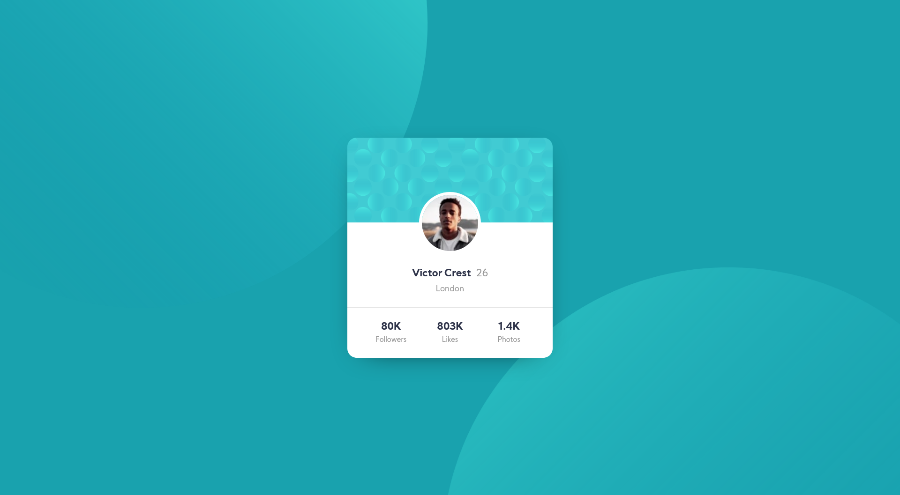

# Frontend Mentor - Profile card component solution

This is a solution to the [Profile card component challenge on Frontend Mentor](https://www.frontendmentor.io/challenges/profile-card-component-cfArpWshJ). Frontend Mentor challenges help you improve your coding skills by building realistic projects. 

## Table of contents

- [Overview](#overview)
  - [The challenge](#the-challenge)
  - [Screenshot](#screenshot)
  - [Links](#links)
- [My process](#my-process)
  - [Built with](#built-with)
  - [What I learned](#what-i-learned)
- [Author](#author)

## Overview

### The challenge

- Build out the project to the designs provided

### Screenshot

### Links

- Live Site URL: [https://polthm.github.io/profile-card-component/](https://polthm.github.io/profile-card-component/)

## My process

### Built with

HTML and CSS

### What I learned

Making a responsive background

## Author

- Website - [https://pol-thomas.com/](https://pol-thomas.com/)
- Frontend Mentor - [@PolThm](https://www.frontendmentor.io/profile/PolThm)